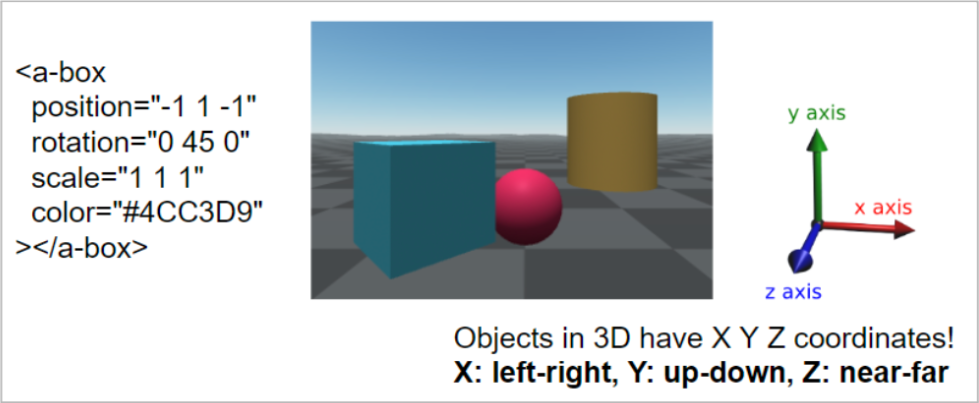
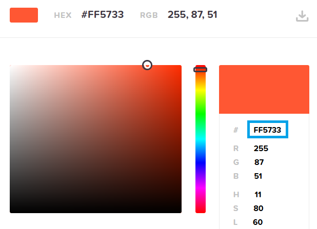
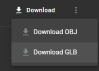
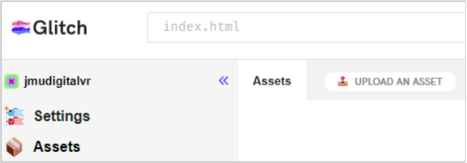
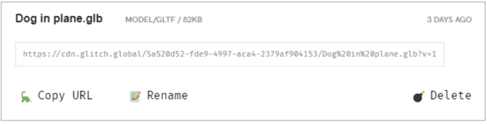

# Day 3: Create your own VR app!

*Bridges to Computing Summer Camp*

## Position, Rotation, and Scale

{width="600px"}

The position, rotation, and scale attributes use X Y Z notation. Position moves an entity (in meters), rotation spins it like a top (0 to 360 degrees), and scale makes it bigger in each direction (# times bigger).

***Challenge:*** Put the sphere on top of the box. What attributes do you need to change? What axes?

## Colors

Go to [htmlcolorcodes.com](https://htmlcolorcodes.com/) and play around with the sliders. Do you see how the color code (something like `#4CC3D9`) on the right changes?

{width="300px"}

You can put these codes into the color attribute to change the color of an entity: `color="#4CC3D9"`.

***Challenge:*** Make the box color JMU purple!

## Other Entities and Shapes

<table>
    <tr>
        <td><a href="https://aframe.io/docs/1.7.0/primitives/a-box.html">&lt;a-box&gt;</a></td>
        <td><a href="https://aframe.io/docs/1.7.0/primitives/a-sphere.html">&lt;a-sphere&gt;</a></td>
        <td><a href="https://aframe.io/docs/1.7.0/primitives/a-cylinder.html">&lt;a-cylinder&gt;</a></td>
        <td><a href="https://aframe.io/docs/1.7.0/primitives/a-cone.html">&lt;a-cone&gt;</a></td>
        <td><a href="https://aframe.io/docs/1.7.0/primitives/a-plane.html">&lt;a-plane&gt;</a></td>
    </tr>
    <tr>
        <td><a href="https://aframe.io/docs/1.7.0/primitives/a-torus.html">&lt;a-torus&gt;</a></td>
        <td><a href="https://aframe.io/docs/1.7.0/primitives/a-torus-knot.html">&lt;a-torus-knot&gt;</a></td>
        <td><a href="https://aframe.io/docs/1.7.0/primitives/a-octahedron.html">&lt;a-octahedron&gt;</a></td>
        <td><a href="https://aframe.io/docs/1.7.0/primitives/a-tetrahedron.html">&lt;a-tetrahedron&gt;</a></td>
        <td><a href="https://aframe.io/docs/1.7.0/primitives/a-dodecahedron.html">&lt;a-dodecahedron&gt;</a></td>
    </tr>
</table>

**Challenge:** Try adding a "torus knot" to your scene and make it orange!

## Adding Text

Add the following entity to your code. Change the <u>value</u> and the <u>color</u> to be whatever you'd like.

```html
<a-text value="Hi! I'm NAME" align="center" color="#FFFFFF"
 rotation="0 0 0" position="0 0.5 -5" scale="3 3 3"></a-text>
```

## Using the Headset

Put on the headset and tighten the top strap and pull on the back strap to make it snug.

{ width="250px"}

Hold the controllers in each hand. Use the **trigger** to select things, and the **grip** button to grab objects.

{ width="400px" }

To move around in your world, push the **thumbstick**/joystick upwards to activate a teleporter, point to where you want to go, then release the stick to teleport there! It's like a superpower!

You can push the stick left and right to turn.

<u>*Why do you think we use teleportation in VR?*</u>

## Changing the Background

In your code, add a new "a-entity" with *environment*, just like below:

```html
<a-entity environment="preset: default; shadow: true"></a-entity>
```

Go to [bit.ly/jmuvr-envs](https://bit.ly/jmuvr-envs) and click left and right at the bottom to see different environments. Make a note of the name ("default", "forest", "egypt", etc.). Replace "default" with the name of the environment you would like.

<u>*Environments:*</u> `default`, `contact`, `egypt`, `checkerboard`, `goaland`, `yavapai`, `goldmine`, `threetowers`, `poison`, `arches`, `tron`, `japan`, `dream`, `volcano`, `starry`, `osiris`, `forest`

## Adding Animations

You can also add the *animation* attribute which lets you animate an object:

```html
animation="property: position;
           from: -1 1 -1;
           to: 1 1 -1;
           dur: 1000;
           loop: 1"
```

"*<u>property</u>*" can be *position*, *rotation*, *scale*, or *color*.

"*<u>from</u>*" is the starting value, "*<u>to</u>*" is the end value for that property.

"*<u>dur</u>*" is the duration in milliseconds (1000 ms = 1 second)

"*<u>loop</u>*" can be true to loop forever, or the number of times to loop the animation

For more examples, go to: [bit.ly/jmuvr-anim](https://bit.ly/jmuvr-anim)

**Challenge:** Make one of the objects grow really wide! What property would you use?

## Adding Interactions

Our world is pretty, but doesn't move, meaning it's *static*.
We would like to move objects around just like the real world!

To make an entity grabbable, add a ***grabbable*** attribute:

```html hl_lines="6"
<a-box
    position="-1 1 -1"
    rotation="0 45 0"
    scale="1 1 1"
    color="#4CC3D9"
    grabbable
></a-box>
```

Add <u>grabbable</u> to every entity EXCEPT the plane (that's the floor).

Now you can grab and move objects around using the grip and trigger on the controller!

## Adding a 3D Model

Go to the [poly.pizza](https://poly.pizza/) website and find a cool model!

Click it, then click Download → **Download GLB**

{width="100px"}

Save it to Downloads or the Desktop.

Now, in Glitch, click on **Assets** in the left menu, then click ***Upload an Asset***:

{width="300px"}

In the file picker, go to the Desktop and select the GLB file you just downloaded. This should upload it into your project! Now, you should see your model inside **Assets**. Click on the model. You should see the following:

{width="400px"}

Click on the **Copy URL** button with the dinosaur 🦕

Go back to your code by clicking on **index.html** under Files in the menu on the left.

Now, create a new entity called `a-gltf-model` with a `src` attribute, just like below.

Inside the quotes for the `src`, paste your URL that you copied (Ctrl-V or right-click → paste):

```html
<a-gltf-model src="PASTE YOUR URL INSIDE HERE"></a-gltf-model>
```

Now your model should appear! You can add the position, rotation, and scale attributes if you’d like:

```html
<a-gltf-model
  src="https://cdn.glitch.global/..."
  position="0 0 0"
  rotation="0 0 0"
  scale="1 1 1"
></a-gltf-model>
```

***Challenge:*** Animate your model so that it spins around and around forever!
