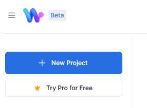
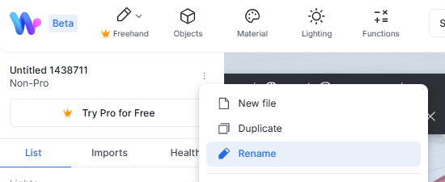
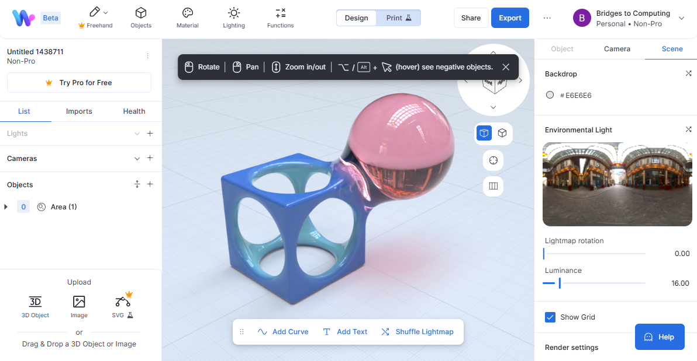
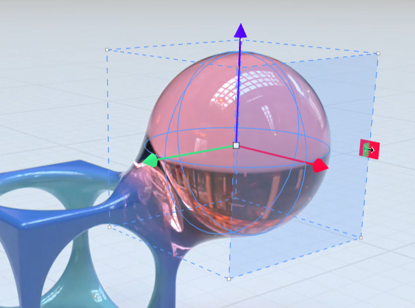
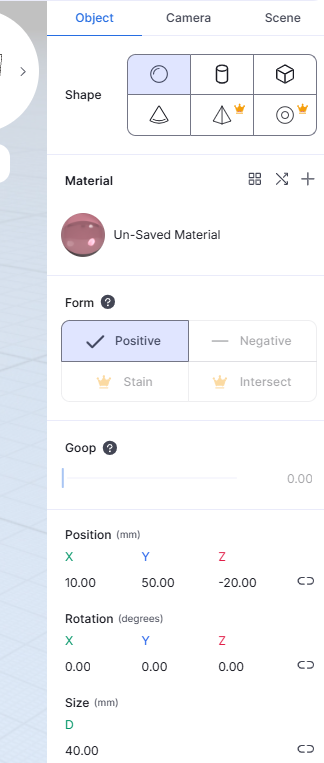
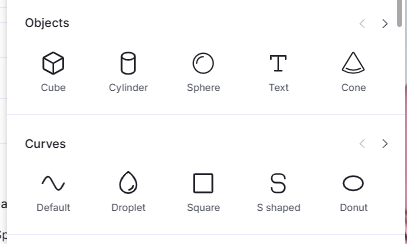
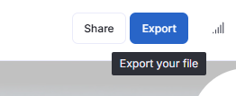
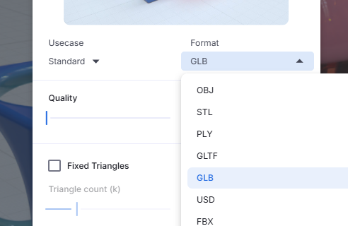

# Challenge: 3D Modeling

What if you want to create your own 3D models for your virtual reality projects?

## Getting Started with Womp

{align="right", width="200px"}

Go to [beta.womp.com](https://beta.womp.com/) and click on "Sign in with Google". Womp is a 3D modeling tool that runs in your web browser.

In the top left corner, click on the **New Project** button to start a new project.

### Name Your Project

The first thing you should do is name your project. Click on the three dots in the top left corner and select **Rename**.

Give your project a name that describes what you want to create, like "Dog".

### The Womp Interface

{width="500px"}

The Womp interface has three important parts:

1. **Objects:** On the left side, you can see all the objects in your scene. You can add new objects, select objects, and delete objects from here.

2. **Viewport:** The center area is where you can see and edit your 3D model. You can rotate, zoom, and pan to view your model from different angles.

3. **Properties:** On the right side, you can see the properties of the selected object. You can change its position, rotation, scale, and other attributes.

### Try Using the Viewport

* Click and drag in the viewport. What happens?
* Scroll with two fingers in the viewport. What happens now?
* Click on an object in the viewport. Did something change?

### Modifying Objects

After clicking on an object, you can see three arrows, a box, and some other controls around it.

These are the **transform controls** that let you move, rotate, and scale the object.

{width="300px"}

Try dragging one of the arrows to move the object. If you click and drag on the corner of the cube or along the edges, you can resize it.

<!-- {align="right", width="200px"} -->

In the **right** sidebar, you can see all the properties of the selected object. You can change its position, rotation, and scale here as well.

Play around with these properties to see how they change the object!

### Adding a New Object

To add a new object, in the left sidebar, click on the Plus (+) button next to **Objects**.

Pick an object type to add it!

That's it! You can create a 3D model by adding and modifying objects in Womp. Try making an animal, a car, or anything else you can imagine!

### Exporting Your Model

When you're done, you can export your model as a GLB file. This is the format we use in our VR projects.

Click on the **Export** button at the top of the screen.

Select "3D Mesh Export".

In the popup dialog, select GLB as the format.

{align="right", width="300px"}

Set the quality all the way left to `0`, then click **Export** at the bottom.

Once the export is done, it will download the GLB file to your computer as a zip file. You can "extract" the zip file to get the GLB file inside.

You can then upload the GLB to your Glitch project and use it in your VR scenes!