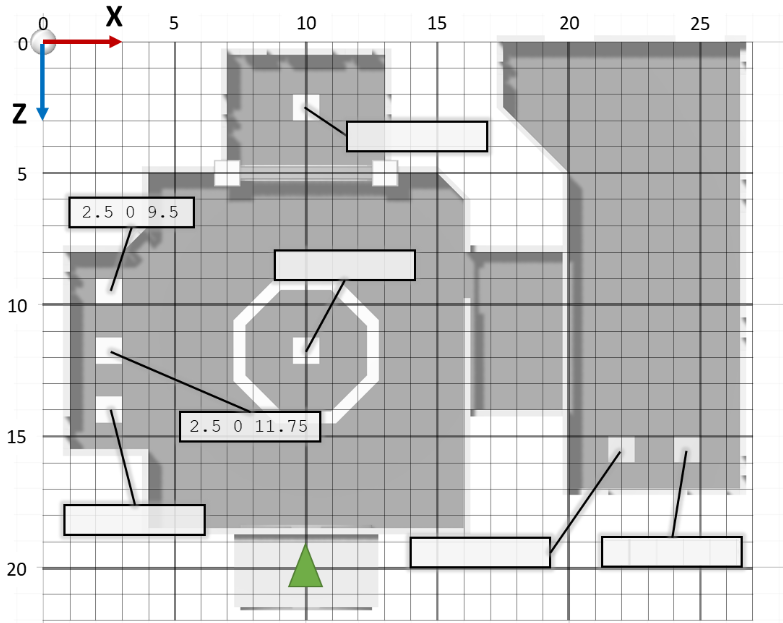
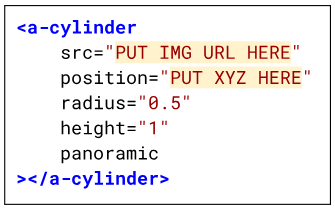
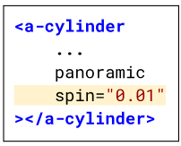
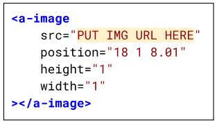
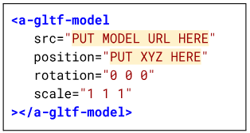

# Day 4: Virtual Gallery

## Museum Map

Remember, position is represented by X (left-right) Y (up-down) Z (back-front). The map of the museum below will help you place objects in your VR scenes.

{width="95%"}

**Challenge:** Fill in the blanks with the coordinates of each of the squares!

## Add a Panorama

{align="right"}

Create ***a-cylinder*** where you want the panorama to be.

In the ***position*** attribute, put the X Y Z coordinates of one of the places from the map.
In the ***src*** attribute, put the URL of an image that you uploaded to the Assets in Glitch.

Make sure to include the *<u>panoramic</u>* attribute at the bottom of the start tag!

## Make the Panorama Spin

{align="right"}

Inside the start tag, after clickable, add a new attribute called **spin**.
This attribute needs a *number* that tells it how fast to spin.

Positive numbers spin clockwise, negative numbers spin counter-clockwise (or anti-clockwise).

## Add a Flat Image

{align="right"}

You can add an image with the **a-image** tag. Make sure to put an image URL in the *src* attribute.

Images have a *height* and a *width*, which you can change.
This example will put an image in the museum's hallway.

**Note:** the Z coordinate is set to <u>8.01</u>. Why do you think that is? What happens when you set it to <u>8</u>?

## Add a 3D Model

{align="right"}

You can download GLB models from the [poly.pizza](https://poly.pizza) website and upload it to your project's **assets**.

In HTML, create a new `a-gltf-model` with a src attribute.
Inside the quotes for the *src*, put the model's URL. 

If you don't see it, try setting `scale="0.01 0.01 0.01"`

## Your Goal

<u>**Fill your museum with images and models of things you like! Decorate it however you want!**</u>
