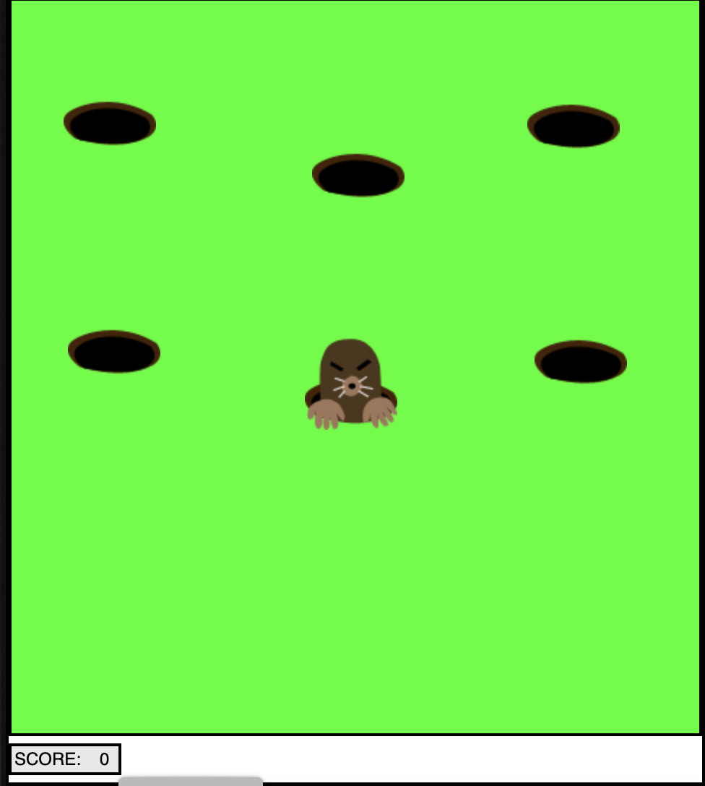
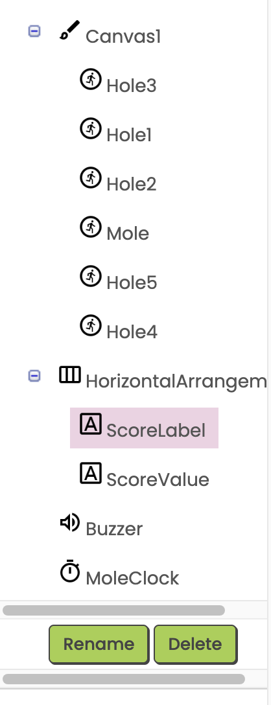

# Day 4: Creating Mobile Apps with MIT App Inventor: Designer

## MIT App Inventor

[App Inventor](https://appinventor.mit.edu/) is a development environment created by MIT for making mobile apps.  It uses a block-based language similar to [Scratch](https://scratch.mit.edu/).

It requires a **GMail account** to create apps.  To run the apps on a device, the device must have an app called **MIT AI2 Companion** installed.  This app is available on Android and iOS.

We will use tablets in the morning and can try switching to phones in the afternoon.

## App Inventor Process

### Designer screen

- Select functional components for your app
- Arrange the user interface (UI) components the way you want the app to look
- Configure each UI component

### Blocks screen

- Program the components to do the desired actions

### Test the app

- Connect to your device to test using the AI2 Companion app
    - Open the AI2 Companion app on the device
    - Scan the QR code
- The app will start and get updated as you make changes

### Build and install the app

You can use the build menu to build the app and install it on your phone (Android phones only).

## Event-driven programming

When an **event** happens on the app, for example:

- Tap the screen
- Drag across an area
- Press a button
- Move a slider
- Shake the phone

You program the app’s response to the event, by telling it what to do when the event happens.

## MoleMash game

We will create and then extend one of the App Inventor tutorial games: MoleMash.

What is a mole?  An animal who digs holes in the ground.

Groundhogs live here in Virginia - they dig holes and eat your vegetables.

The idea of the game is the mole keeps popping up out of holes in your yard and you try to catch him.  Every time you touch the mole, you get a point.

## Designer

We will add the following components to our game.

From **Drawing and Animation**

- **canvas** - the area on which the game is played
- **sprites** - the objects that are part of the game.  Create 5 hole sprites and 1 mole sprites and make sure they are inside the canvas.

From **Layout**

- **horizontal layout** - place it below the canvas

From **User Interface**

- **label** - get 2 labels and place them inside the horizontal layout

From **Media**

- **sound** - add 1 sound component to your app

From **Sensors**

- **clock** - add 1 clock component to your app

Add the components and rename them (using the rename button) something like what is shown in figure below:

### Properties

Download the following images:

- [hole.png](app/hole.png)
- [molesprite.png](app/molesprite.png)
- [beep.mp3](app/beep.mp3)

Upload the 2 images and 1 sound into the app using the media tab.

Use the right-hand menu to set the component properties.  We will set several of them together:

- Set the device type to **Monitor**
- Set the size and color of the Canvas
- Set the mole sprite's image and Z value to 2.0
- Arrange the holes
- Set the score label's text to "SCORE: "
- Set the buzzer's sound file

## References and resources
- [Mole image](https://www.columbiatribune.com/story/lifestyle/family/2017/10/10/the-secret-lives-moles/18339608007/)
- [Groundhog image](https://www.fws.gov/story/fun-facts-about-groundhogs)
- [Beep sound](https://pixabay.com/sound-effects/point-smooth-beep-230573/)
- [MoleMash Tutorial](https://appinventor.mit.edu/explore/ai2/molemash-2)
