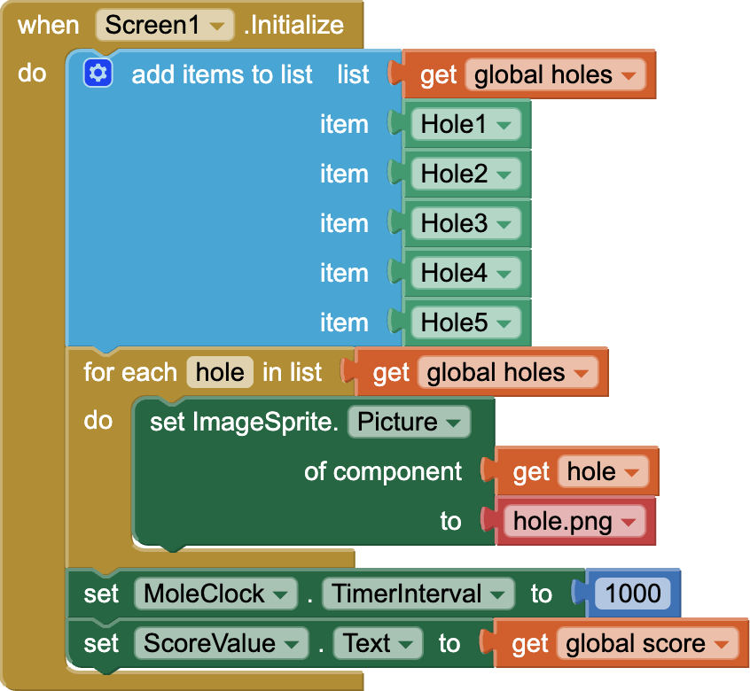
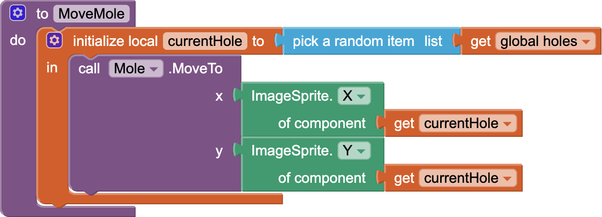
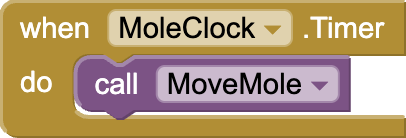
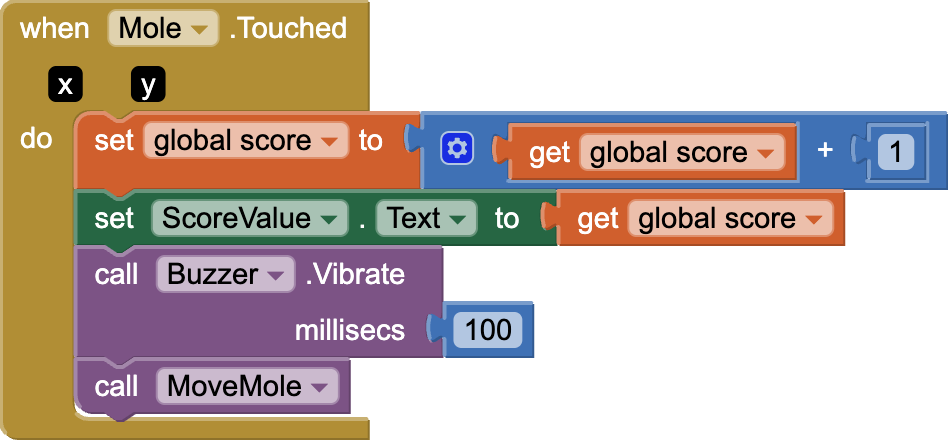

# Day 4: Creating Mobile Apps with MIT App Inventor: Blocks Programming

Although the [App Inventor](https://appinventor.mit.edu/) code is on blocks, instead of being typed in like Python, it has the same concepts: variables, lists, functions, etc.

## Initialization

Set everything up so that the app starts the same way every time.

### Global Variables

- Create a variable to hold the list of holes
  

- Create a variable to hold the score
  

### Screen Initialization

- Fill the list with the holes
- Initialize the hole sprites with the hole image
- Initialize the timer to have to mole move once every second (1000 milliseconds)
- Initialize the score value label with the initial score.
  

## Program the app

Write the code for the mole to pop out of the holes randomly, and write the code to add a point every time the user touches the mole.

### Move the mole

Each sprite has a **position** on the *canvas*.  That position is an **(x,y)** location.

Create a procedure (function) to move the mole:

- Set a *local* variable to be a **random** hole
- Set the mole sprite's position to be the same position (X and Y position) as the random hole that was selected

Use the **clock** to move the mole every time the timer goes off.

### Keep score

Whenever the player touches the mole sprite, update the score.

- add 1 to the score
- show the new score
- use the **sound** component to vibrate the device
- call the procedure to move the mole again

